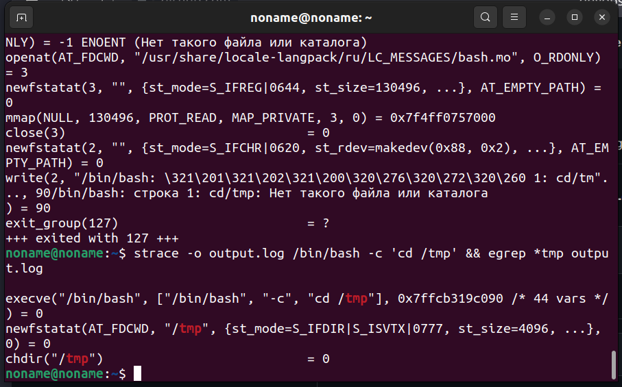
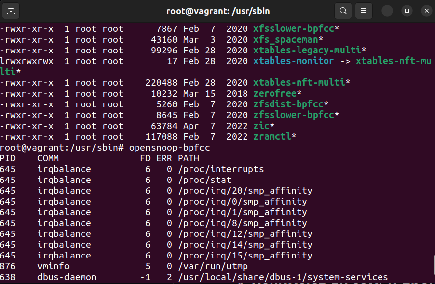
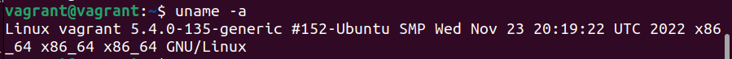

1. **Какой системный вызов делает команда cd?
   В прошлом ДЗ вы выяснили, что cd не является самостоятельной программой. Это shell builtin, поэтому запустить strace непосредственно на cd не            получится.    Вы можете запустить strace на /bin/bash -c 'cd /tmp'. В этом случае увидите полный список системных вызовов, которые делает сам bash при    старте.
   Вам нужно найти тот единственный, который относится именно к cd. Обратите внимание, что strace выдаёт результат своей работы в поток stderr, а не в        stdout.**
   
   
   
2. **Попробуйте использовать команду file на объекты разных типов в файловой системе. Используя strace, выясните, где находится база данных file, на          основании которой она делает свои догадки.**
   

3. **Предположим, приложение пишет лог в текстовый файл. Этот файл оказался удалён (deleted в lsof), но сказать сигналом приложению переоткрыть файлы или 	 просто перезапустить приложение возможности нет. Так как приложение продолжает писать в удалённый файл, место на диске постепенно заканчивается. 		    Основываясь на знаниях о перенаправлении потоков, предложите способ обнуления открытого удалённого файла, чтобы освободить место на файловой                системе.**
    
   в таком случае нужно отправить в файл пустой символ, для того чтобы он перезаписал содежимое файла собой.
   Например: 

4. **Занимают ли зомби-процессы ресурсы в ОС (CPU, RAM, IO)?**

   Зомби не занимают памяти (как процессы-сироты), но блокируют записи в таблице процессов, размер которой ограничен для каждого пользователя и системы в    целом.
   
5. **В IO Visor BCC есть утилита opensnoop. На какие файлы вы увидели вызовы группы open за первую секунду работы утилиты?**

   
   
6. **Какой системный вызов использует uname -a? Приведите цитату из man по этому системному вызову, где описывается альтернативное местоположение в /proc и      где можно узнать версию ядра и релиз ОС.**

    uname -a - выводит системную информацию:
    
    
    
    Part of the utsname information is also accessible via /proc/sys/kernel/{ostype, hostname, osrelease, version, domainname}.
   
7. **Чем отличается последовательность команд через ; и через && в bash? Есть ли смысл использовать в bash &&, если применить set -e?**

   1)С использованем ; обе команды отработают в любом случае.
   2)С использованием && вторая команда отработает только при успешном результате первой.
   3)С применением set -e скрипт/оболочка завершит работу при возникновении ошибки. Думаю, что нет смысла использовать && при set -e, т.к в случае ошибки       скрипт прервёт свою работу до того как дойдёт да проверки результата выхода через   &&.

8. **Из каких опций состоит режим bash set -euxo pipefail и почему его хорошо было бы использовать в сценариях?**

   set -e скрипт немедленно завершит работу, если любая команда выйдет с ошибкой.
   set -u - ппроверяет инициализацию переменных в скрипте, если переменной не будет, скрипт немедленно завершиться.
   set -x - с помощью него bash печатает в стандартный вывод все команды перед их исполнением.
   set -o pipefail - чтобы убедиться, что все команды в пайпах завершились успешно. 
   Думаю такую конструкцию было бы полезно использовать перед началом сценариев, чтобы предотвратить упущенные ошибки, которые могут привести к различным    неисправностям.
