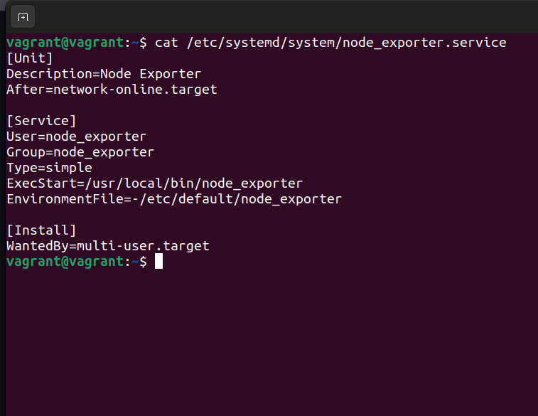
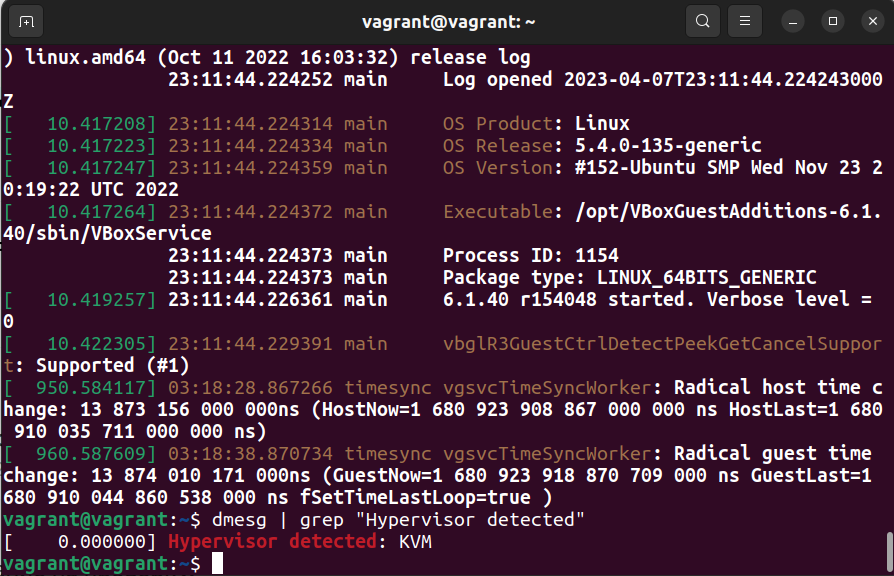

1. **На лекции вы познакомились с node_exporter. В демонстрации его исполняемый файл запускался в background. Этого достаточно для демо, но не для              настоящей    production-системы, где процессы должны находиться под внешним управлением. Используя знания из лекции по systemd, создайте                    самостоятельно     простой unit-    файл для node_exporter**

    Создаём unit-файл для node_exporter: sudo vi /lib/systemd/system/node_exporter.service;
    
    
    
    Обновляем конфигурацию и добавить в автозагрузку:
    
    sudo systemctl daemon-reload

    sudo systemctl enable node_exporter.service
    
    Делаем перезагрузку машины: sudo reboot
    
    Проверяем стату службы после перезагрузки: sudo systemctl status node_exporter.service
    
    
    
2. **Изучите опции node_exporter и вывод /metrics по умолчанию. Приведите несколько опций, которые вы бы выбрали для базового мониторинга хоста по CPU,          памяти, диску и сети.**

    Чтобы активировать дополнительные опции для базового мониторинга хоста по CPU, памяти, диску и сети, добавим флаг –collector. в файл                     node_exporter.service при запуске:
    
    ExecStart=/usr/local/bin/node_exporter  --collector.disable-defaults --collector.netstat --collector.meminfo --collector.cpu --collector.filesystem
    
    
    
3. **Установите в свою виртуальную машину Netdata. Воспользуйтесь готовыми пакетами для установки (sudo apt install -y netdata).

    После успешной установки:

    в конфигурационном файле /etc/netdata/netdata.conf в секции [web] замените значение с localhost на bind to = 0.0.0.0;
    добавьте в Vagrantfile проброс порта Netdata на свой локальный компьютер и сделайте vagrant reload:
    config.vm.network "forwarded_port", guest: 19999, host: 19999
    После успешной перезагрузки в браузере на своём ПК (не в виртуальной машине) вы должны суметь зайти на localhost:19999. Ознакомьтесь с метриками,           которые по умолчанию собираются Netdata, и с комментариями, которые даны к этим метрикам.**
    
    
    
4. **Можно ли по выводу dmesg понять, осознаёт ли ОС, что загружена не на настоящем оборудовании, а на системе виртуализации?**

   Это можно проверить если в выводе dmesg проверить наличие параметра "Hypervisor detected". Если операционная система находится на виртуальной машине,    то данный параметр будет присутствовать в выводе команды dmesg, если на физической машине, нет.
   
   
   
5. **Как настроен sysctl fs.nr_open на системе по умолчанию? Определите, что означает этот параметр. Какой другой существующий лимит не позволит достичь      такого числа (ulimit --help)?**

    sysctl fs.nr_open - параметр означает максимальное количество дескрипторов файлов, которое может выделить процесс. Значение по умолчанию - 1024х1024    (1048576), чего должно хватить для большинства машин. Фактический лимит зависит от лимита ресурсов RLIMIT_NOFILE.
    
    RLIMIT_NOFILE — указывает значение, которое больше максимального номера дескриптора файла, который может быть открыт этим процессом.
    
    Также максимальное количество открытых файлов для процесса мы можем увидеть через ulimit. Есть жесткий и мягкий лимиты максимально открытых               дескрипторов. Пользователь имеет право увеличить "мягкий" лимит до значения "жесткого".
    
    
    
6. **Запустите любой долгоживущий процесс (не ls, который отработает мгновенно, а, например, sleep 1h) в отдельном неймспейсе процессов; покажите, что        ваш процесс работает под PID 1 через nsenter. Для простоты работайте в этом задании под root (sudo -i). Под обычным пользователем требуются              дополнительные опции (--map-root-user) и т. д.**

    Запущен долгожевущий процесс sleep 1h.
    
    
    
7. **Найдите информацию о том, что такое :(){ :|:& };:. Запустите эту команду в своей виртуальной машине Vagrant с Ubuntu 20.04 (это важно, поведение в        других ОС не проверялось). Некоторое время всё будет плохо, после чего (спустя минуты) — ОС должна стабилизироваться. Вызов dmesg расскажет, какой        механизм помог автоматической стабилизации.
     Как настроен этот механизм по умолчанию, и как изменить число процессов, которое можно создать в сессии?**
     
     При запуске эта функция создаёт две свои копии при каждом вызове, запускает их в фотоном режиме, и происходит это пока не закончатся системные            ресурсы.
     
     :() означает, что вы определяете функцию под названием :

      {:|: &}означает запустить функцию :и :снова отправить ее вывод в функцию и запустить ее в фоновом режиме.

      Это ;разделитель команд.

      : запускает функцию в первый раз.

      По сути, вы создаете функцию, которая вызывает себя дважды при каждом вызове и не имеет возможности завершить себя. Он будет удваиваться, пока у         вас не закончатся системные ресурсы.
      
      Ограничить количество запущенных процессов для пользователя можно с помощью ulimit -u.
      
      
    
